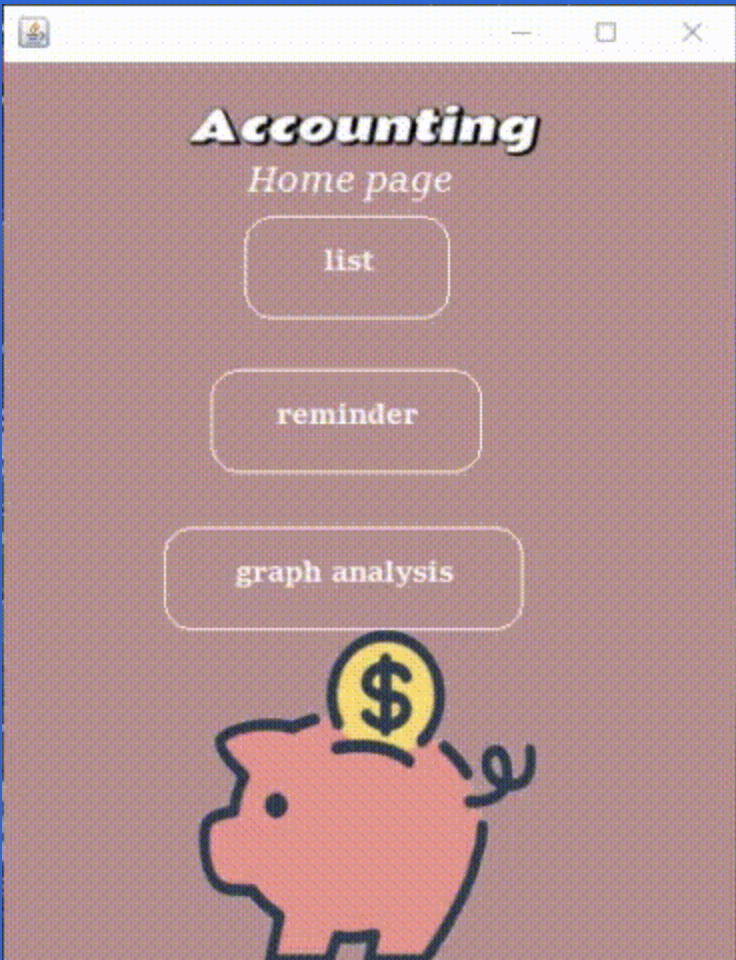
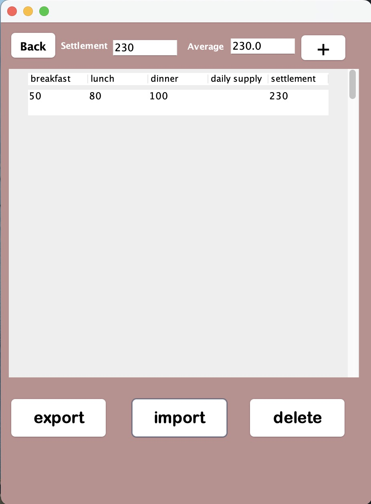
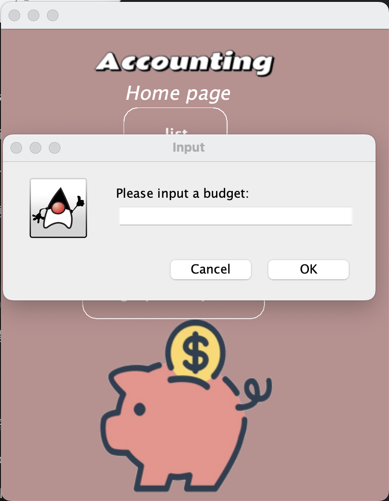
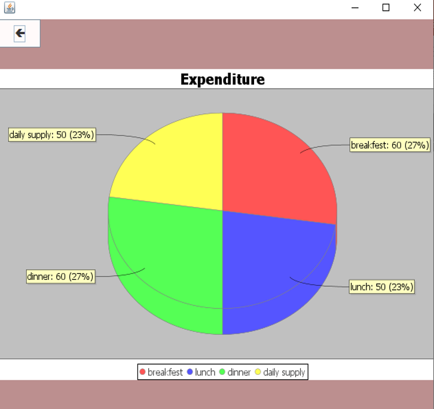
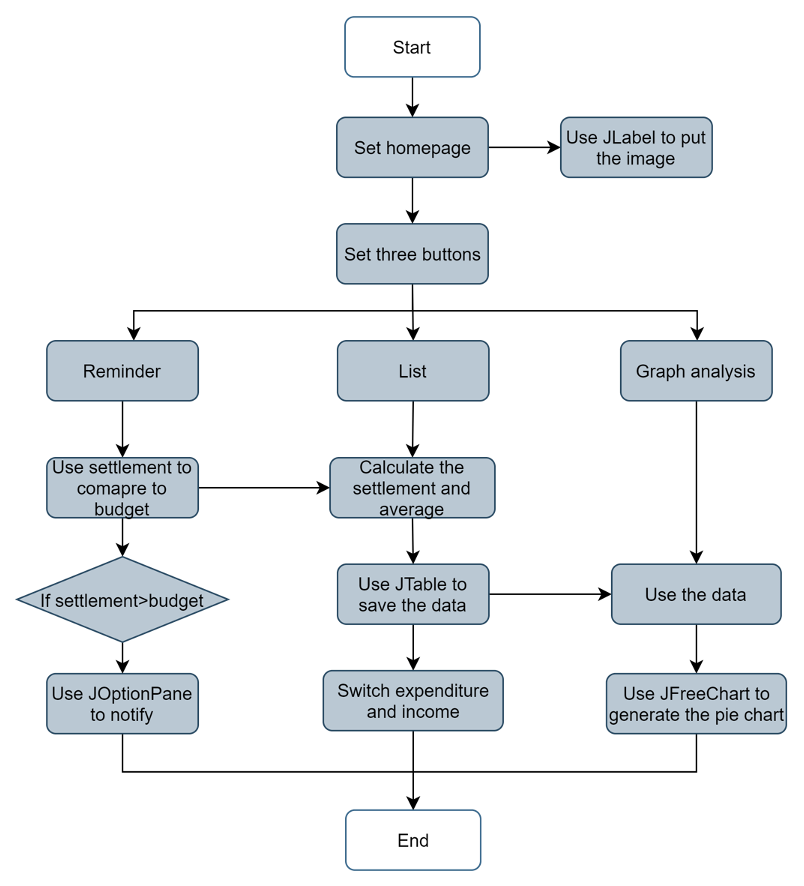

# Java Accounting Program

This accounting program helps users manage and analyze their expenses. It is divided into three main components: **List**, **Reminder**, and **Graph Analysis**.

---

## Program Overview

---

## 1. List

The **List** feature allows users to record detailed expense data. Users can:
- Add item details such as breakfast, lunch, dinner and daily supply.
  
Users can also:
- **Export** data for external use.
- **Import** data from saved files.
- **Delete** records for data management.

---

## 2. Reminder

The **Reminder** feature ensures users stay within their budget by:
- Automatically alerting users if their expenses exceed the specified budget.

---

## 3. Graph Analysis

The **Graph Analysis** feature visualizes spending data using JFreeChart. This enables users to:
- Gain insights into overall expenses.
- Identify spending patterns through **pie charts** for better clarity.

---

## Program Flowchart

Below is the flowchart that outlines the program's main operations and their relationships:

